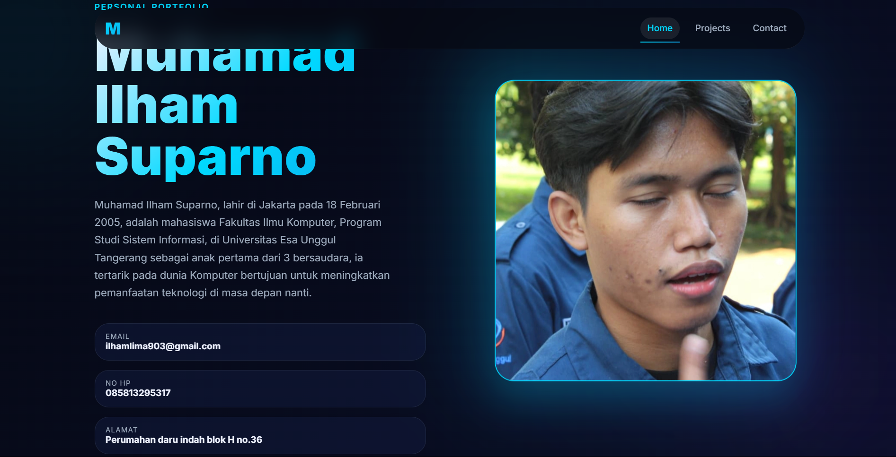
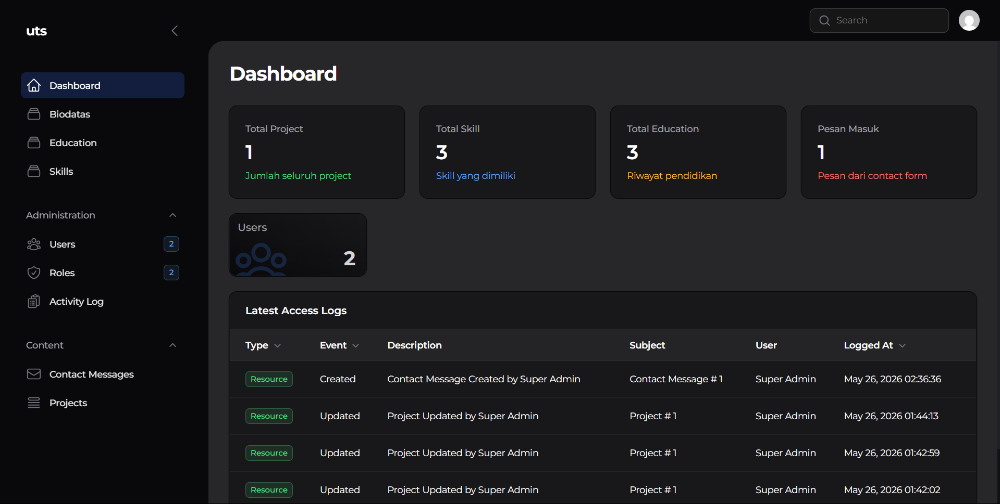
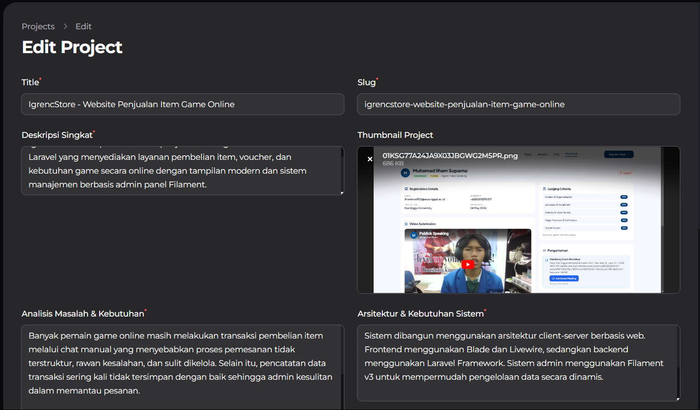
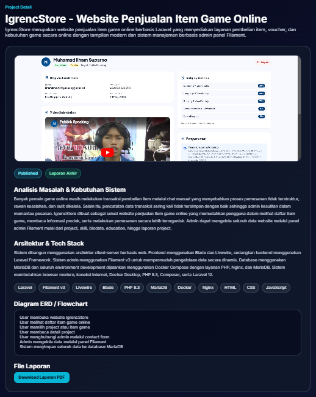

# 🎮 IgrencStore.id

Website portfolio dan management project berbasis Laravel 12 yang dibangun menggunakan Filament v3, Livewire, Docker, dan MariaDB.

Project ini dibuat untuk memenuhi tugas UTS Mata Kuliah Pemrograman Web sekaligus sebagai media pembelajaran pengembangan aplikasi modern berbasis Laravel ecosystem.  
Seluruh data website dapat dikelola secara dinamis melalui admin panel Filament tanpa perlu mengubah source code secara langsung.

Selain sebagai portfolio website, project ini juga dirancang sebagai fondasi awal online game item store yang nantinya akan dikembangkan menjadi sistem e-commerce digital.

---


---

# ✨ Fitur Utama

- Dynamic Portfolio Website
- Admin Panel Filament v3
- CRUD Biodata
- CRUD Skill
- CRUD Education
- CRUD Project
- Upload Thumbnail Project
- Upload PDF Laporan
- Dynamic Slug URL
- Dashboard Statistics Widget
- Contact Form
- Responsive UI
- Docker Development Environment
- Role Authentication
- File Storage Management

---

# 🖼 Preview Project

## 🏠 Home Page



---

## 🛠 Admin Dashboard



---

## 📂 Projects Page



---

## 📄 Project Detail



---

# 🛠 Tech Stack

| Technology | Description |
|---|---|
| Laravel 12 | Backend Framework |
| Filament v3 | Admin Panel |
| Livewire | Dynamic Component |
| Blade | Templating Engine |
| MariaDB | Database |
| Docker | Containerization |
| Nginx | Web Server |
| PHP 8.3 | Backend Language |

---

# 🧠 Arsitektur Sistem

## Frontend
- Blade
- Livewire
- HTML
- CSS
- JavaScript
- Tailwind CSS

---

## Backend
- Laravel 12
- Filament v3
- Eloquent ORM
- Authentication System

---

## Database
- MariaDB

---

## Infrastructure
- Docker
- Docker Compose
- Nginx

---

# 📂 Struktur Project

```text
uts/
├── db/
├── docs/
├── nginx/
├── php/
├── src/
│   ├── app/
│   ├── database/
│   ├── public/
│   ├── resources/
│   └── routes/
├── docker-compose.yml
└── README.md
⚙️ Panduan Instalasi
1. Clone Repository
git clone https://github.com/igrencid/uts.git
cd uts
2. Jalankan Docker
docker compose up -d --build

Atau menggunakan custom command:

dcu -d --build

Service yang akan berjalan:

PHP 8.3
Nginx
MariaDB
3. Masuk ke Container PHP
docker compose exec php bash
4. Install Dependency
composer install
5. Setup Environment
cp .env.example .env
php artisan key:generate
6. Jalankan Migration dan Seeder
php artisan migrate --seed

Atau menggunakan custom command:

dca migrate --seed
7. Storage Link
php artisan storage:link
🚀 Menjalankan Project

Setelah seluruh service berjalan:

Frontend
https://uts.test
Admin Panel
https://uts.test/admin
🔐 Demo Login
👑 Super Admin
Email    : admin@admin.com
Password : password

Akses penuh ke seluruh fitur sistem.

👤 User
Email    : user@admin.com
Password : password

Akses terbatas sesuai role permission.

📊 Dashboard Widget

Dashboard admin menampilkan:

Total Project
Total Skill
Total Education
Total Contact Message
📁 Sistem Project Dinamis

Setiap project mendukung fitur:

Upload Thumbnail
Dynamic Slug
Upload PDF
Tech Stack
Status Badge
Detail Project Page
🧪 Contoh Workflow Development
Membuat Resource Filament
dcm Project
Menjalankan Migration
dca migrate
Menjalankan Seeder
dca db:seed
🚀 Pengembangan Selanjutnya

Beberapa fitur yang akan dikembangkan:

Shopping Cart
Checkout System
Midtrans Payment Gateway
Order Management
Product Category
Search & Filter
Live Deployment
Dark Mode
Activity Log
📌 Catatan
Pastikan Docker Desktop berjalan sebelum menjalankan project.
Pastikan domain uts.test sudah diarahkan ke localhost.
Browser yang direkomendasikan:
Google Chrome
Microsoft Edge
🤝 Contribution

Project ini dibuat untuk pembelajaran.
Apabila ingin melakukan pengembangan:

Fork repository
Create new branch
Commit perubahan
Push branch
Open pull request
👨‍💻 Developer
Nama	Informasi
Nama	Muhamad Ilham Suparno
NIM	20240803049
Universitas	Universitas Esa Unggul
Mata Kuliah	Pemrograman Web
📜 License

Project ini dibuat untuk kebutuhan pembelajaran, portfolio, dan pengembangan pribadi.

MIT License © 2026 igrencid

⭐ Repository
https://github.com/igrencid/uts